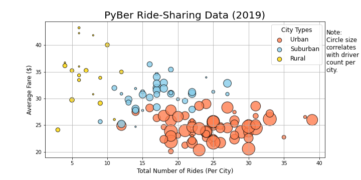
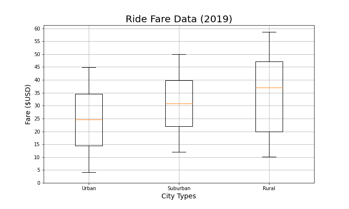
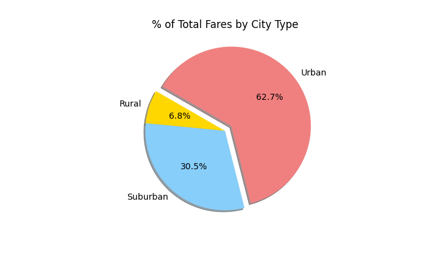
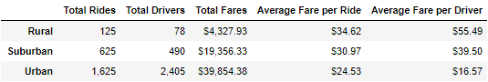
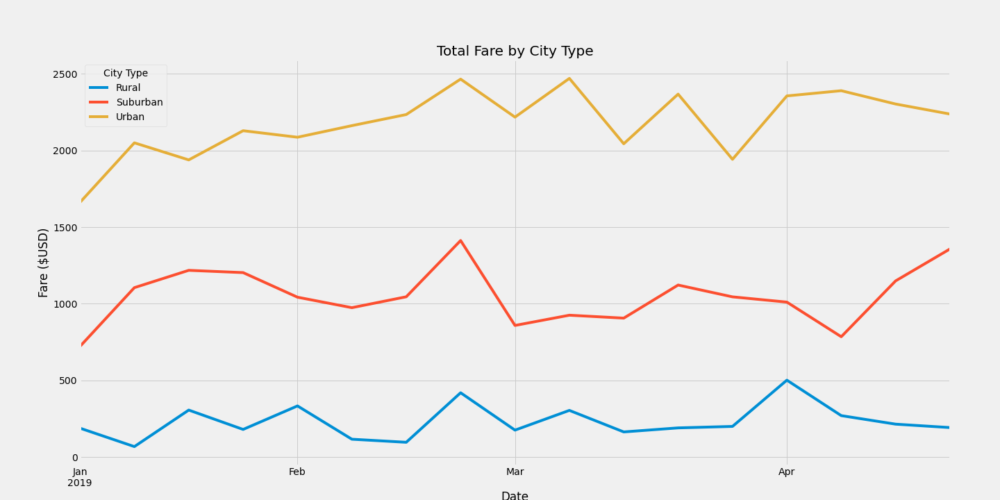

# PyBer_Analysis
## Visualizing Ride-Sharing data

## Project Overview
PyBer is a Python based ride-sharing app company. An exploratory analysis will be run in order to showcase the relationship between the type of city, the number of drivers and riders, and the fare of the rides. The goal is to improve ride-sharing access and affordability.  

## Resources
- Data Source: city_data.csv & ride_data.csv
- Software: Python 3.7.7, Conda 4.8.3, Pandas 1.0.5, Matplotlib 2.2.2, Jupyter Notebook

## Summary

- Created a bubble chart that showcases the average fare versus the total number of rides with bubble size based on the average number of drivers for each city type: urban, suburban, and rural. 

- Box-and-whisker plots were created to display information about the distribution of rides, fares, and drivers for each city type. Comparing the ride count data, it can be seen that the average number of rides in the rural cities is about 4 to 3.5 times lower than urban and suburban cities, respectively. In addition, there is one outlier, 39 rides in West Angela, from the urban ride count. 

- The average fare for rides in the rural cities is about $11 and $5 more per ride than the urban and suburban cities, respectively. Comparing to the ride count data, it can be determined that as the number of rides decrease in each city type, the price of the fare increases. 

- The average number of drivers in rural cities is 9 to 4 times lower per city than urban and suburban cities respectively. Overall, city types with less drivers have fewer rides and higher fare prices. 

- Created a pie chart to showcase the percentage of fares for each city type. Rides in urban cities make up the largest percentage of fares, 62.7% of total fares. 

- Created a pie chart so that each pie wedge represents the percentage of total rides for each city type. Again, urban cities made up the largest percentage, 68.4% of total rides.  

- The final pie chart created displays the percentage of the total drivers for each city type. Urban cities had the largest percentage of drivers while rural cities made up less than 1% of the total drivers. 

## Challenge Overview

## Challenge Summary

