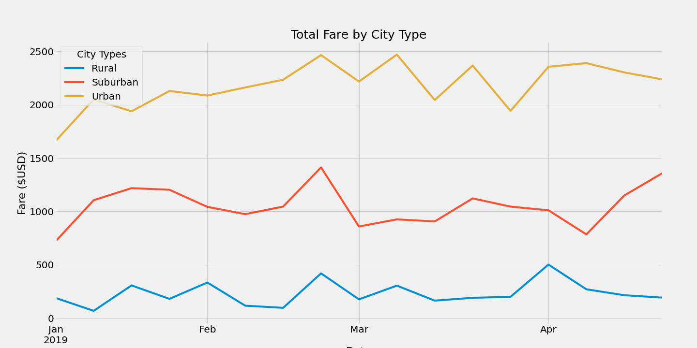

# PyBer_Analysis
## Visualizing Ride-Sharing data

## Project Overview
PyBer is a Python based ride-sharing app company. An exploratory analysis will be run in order to showcase the relationship between the type of city, the number of drivers and riders, and the fare of the rides. The goal is to improve ride-sharing access and affordability.  

## Resources
- Data Source: city_data.csv & ride_data.csv
- Software: Python 3.7.7, Conda 4.8.3, Pandas 1.0.5, Matplotlib 2.2.2, Jupyter Notebook

## Summary

- Created a bubble chart that showcases the average fare versus the total number of rides with bubble size based on the average number of drivers for each city type: urban, suburban, and rural. 

- Box-and-whisker plots were created to display information about the distribution of rides, fares, and drivers for each city type. Comparing the ride count data, it can be seen that the average number of rides in the rural cities is about 4 to 3.5 times lower than urban and suburban cities, respectively. In addition, there is one outlier, 39 rides in West Angela, from the urban ride count. 

- The average fare for rides in the rural cities is about $11 and $5 more per ride than the urban and suburban cities, respectively. Comparing to the ride count data, it can be determined that in general, as the number of rides decrease in each city type, the price of the fare increases. 

- The average number of drivers in rural cities is 9 to 4 times lower per city than urban and suburban cities respectively. Overall, city types with less drivers have fewer rides and higher fare prices. 

- Created a pie chart to showcase the percentage of fares for each city type. Rides in urban cities make up the largest percentage of fares, 62.7% of total fares. 

- Created a pie chart so that each pie wedge represents the percentage of total rides for each city type. Again, urban cities made up the largest percentage, 68.4% of total rides.  

- The final pie chart created displays the percentage of the total drivers for each city type. Urban cities had the largest percentage of drivers while rural cities made up less than 1% of the total drivers. 

## Challenge Overview
Created a summary DataFrame of ride-sharing key metrics by city type and created a multiple-line graph that shows the total fares for each week by each city type. 

## Challenge Reprt

We have started to breakdown and analyze ride sharing data by creating bubble charts, box-and-whisker plots, and pie charts to determine correlations between the number of rides and drivers and fare price depending on city type: urban, suburban, rural. To further analyze the data, a summary DataFrame has been compiled to allow us to have a quick look as to how the data varies for each city type. From the DataFrame, we can gather that rural cities have the lowest number of rides and drivers, but the highest average fare per ride and highest average fare per driver. In addition to the summary DataFrame, we also plotted total fare by city type over the span of multiple months. Overall, the urban cities amounted more total fares than suburban and rural cities, respectively. In addition, an increase in total fares can be seen about mid-February. The summary DataFrame and line chart are displayed below:

There was no missing data or null values in either of the two DataFrames that were merged inorder to create a single summary DataFrame. If there had been missing or null values, the DataFrames would have needed to be cleaned before they were merged together. If data is not cleaned, it can cause calculation issues later on in the analysis. One challenge that was observed was Setting the "Date" index to datetime in the new dataframe for fares. If the index is not set to a datetime index, then you would be unable to resample the data into weekly bins. 

Based on the data analysis, city types with less drivers have fewer rides and higher fares. This can be seen by the disparity between rural and urban city types. The next steps would be to determine if less drivers directly causes fewer rides, or if higher fare prices results in less rides. To further analyze this question, I would recommend creating scatter plots. Scatter plots can visually depict where there is a relationship between two factors and can then be used to make predictions. I would suggest creating a scatter plot of fares versus 
