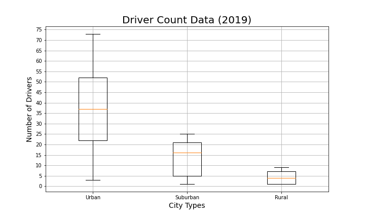
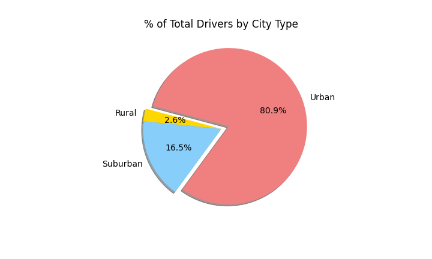

# PyBer_Analysis

## Project Overview

## Resources
- Data Source: city_data.csv & ride_data.csv
- Software: Python 3.7.6, Conda 4.8.3, Pandas, Jupyter Notebook

## Summary

## Challenge Overview

## Challenge Summary

